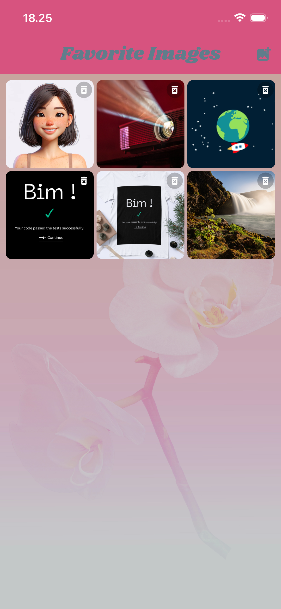
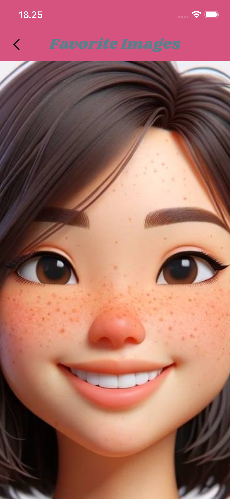

# Favorite Images 📸
A Flutter prototype gallery app for photo-sharing startup. Capture photos or select from gallery, browse in clean grid layout, view full-size with zoom. Built for investor demo.

### ✨ Features
✅ Camera & Gallery picker (image_picker)

✅ Interactive grid gallery (FavGalleryScreen - 3-column, delete icons)

✅ Full-screen zoom viewer (FullImageScreen - pinch/rotate/pan)

✅ Cross-platform (Android/iOS emulators + devices)

✅ Clean UI (Google Fonts, custom backgrounds)

## 📱 Screenshots

| Grid View | Full Image | Full Image Zoom|
| ---------- | ---------------- | --------- |
|  |  |  |                 


## 🛠️ Tech Stack

• Flutter 3.41.1 (stable)

• image_picker (^1.1.2)

• google_fonts (^8.0.1)

• Platforms: Android, iOS

## 🚀 Setup & Run
```
# Clone & install

git clone https://01.gritlab.ax/git/mreunsat/favorite-images
cd favorite_images
flutter pub get

# Check the list of available emulators 
flutter emulators

# Android only (ex. Id = Pixel_8)
flutter emulators --launch Pixel_8
flutter run

# iOS only (ex. Id = apple_ios_simulator)
flutter emulators --launch apple_ios_simulator
flutter run
```

## 📝 Learning Objectives Achieved
 - Device camera/gallery (image_picker)

 - Grid-based gallery (FavGalleryScreen)

 - Pinch-to-zoom (FullImageScreen)

 - Platform permissions (Info.plist + AndroidManifest.xml)

## 🎯 iOS Permissions (ios/Runner/Info.plist)
```xml
<key>NSCameraUsageDescription</key>
<string>Camera access to capture favorite images</string>
<key>NSPhotoLibraryUsageDescription</key>
<string>Photo library access to select favorite images</string>
```

## 📂 Project Structure

```text
lib/
├── main.dart                  # App entry 
├── fav_gallery_screen.dart    # Gallery grid + picker
└── full_image_screen.dart     # Zoom viewer
assets/
└── images/
    └── gallery_bg.jpg         # Grid background
```

## Author
[Mayuree Reunsati](https://github.com/mareerray)